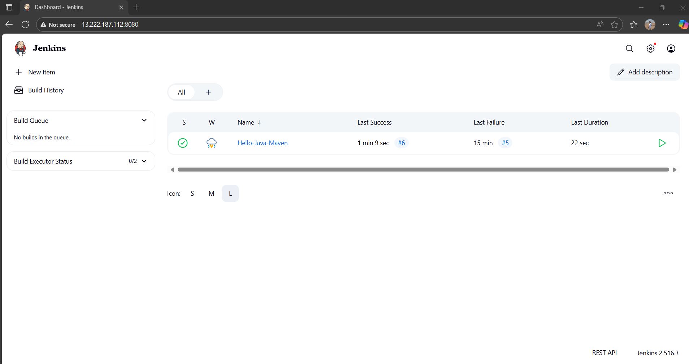
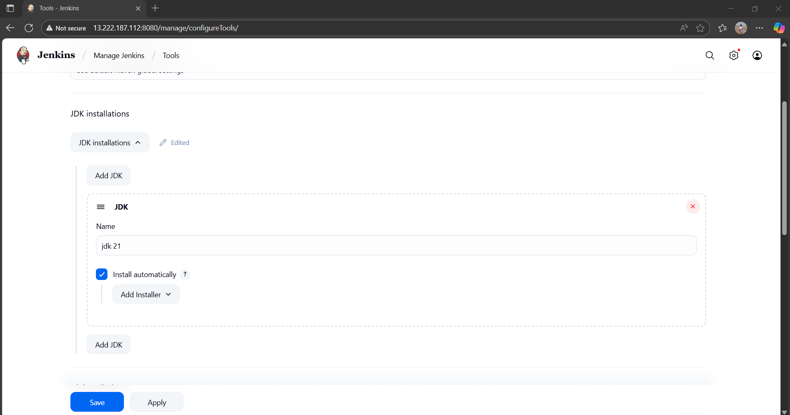
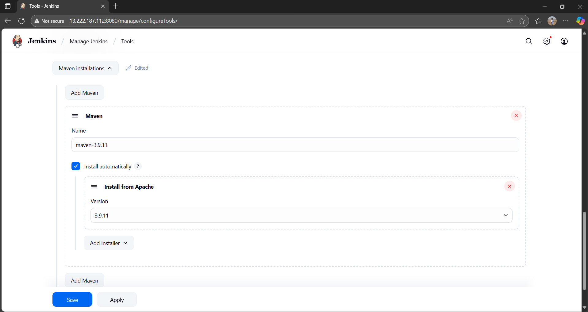
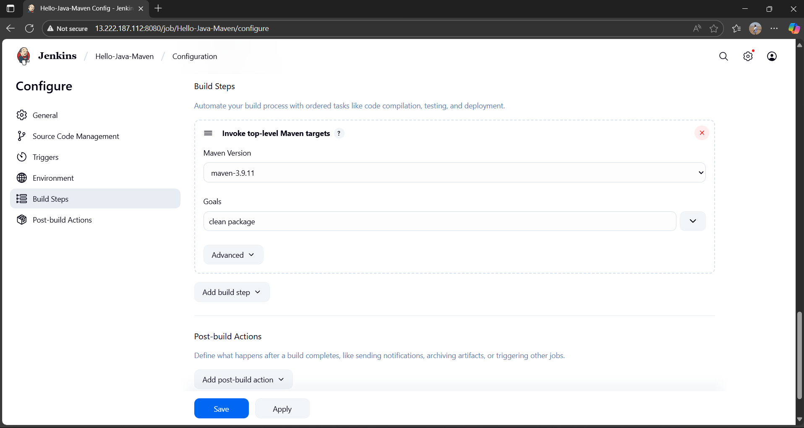

🚀🚀 Jenkins + Maven Hello World

The task was to set up a simple CI build pipeline using Jenkins and Maven for a basic Java project.

## 📌 Objective

- Use Jenkins to build a Java Hello World app using Maven
- Learn Jenkins freestyle jobs, tool configuration, and Maven lifecycle
- Capture the full CI flow from code to build

---

## 🧰 Tools & Technologies

- Java 21
- Maven 3.9.9
- Jenkins (via Docker)
- Git + GitHub (for repo hosting)

---

## 📁 Project Structure

jenkins-maven-hello/ 
<br>├── pom.xml 
<br>└── src/ 
<br>└── main/ 
<br>└── java/
<br>└── screenshots/
<br>└── HelloWorld.java

yaml
Copy
Edit

---

## 📜 Java Code

### `HelloWorld.java`
```
public class HelloWorld {
    public static void main(String[] args) {
        System.out.println("Hello, Jenkins + Maven!");
    }
}
```
⚙️ Maven Configuration
pom.xml
```
<project>
    <modelVersion>4.0.0</modelVersion>
    <groupId>com.example</groupId>
    <artifactId>hello</artifactId>
    <version>1.0</version>
    <build>
        <plugins>
            <plugin>
                <groupId>org.apache.maven.plugins</groupId>
                <artifactId>maven-compiler-plugin</artifactId>
                <version>3.8.1</version>
                <configuration>
                    <source>1.8</source>
                    <target>1.8</target>
                </configuration>
            </plugin>
        </plugins>
    </build>
</project>
```
🚀 Jenkins Setup Steps
Ran Jenkins in Docker:
```
docker run -p 8081:8080 -v jenkins_home:/var/jenkins_home jenkins/jenkins:lts
```
Unlocked Jenkins and installed suggested plugins

Configured JDK and Maven under Global Tool Configuration

Created a Freestyle Job:
```
Build step: Invoke top-level Maven targets
```
```
Goal: clean package
```
✅ Build Output
Job built successfully using Jenkins + Maven

Console output showed:
```
[INFO] BUILD SUCCESS
```
### 📸 Screenshots

#### ✅ Jenkins Home Dashboard :


#### ✅ Global Tool Configuration showing JDK and Maven setup :
 || 

#### ✅ Freestyle job configuration (Build step with clean package) :


#### ✅ Build history with green check :


#### ✅ Console Output showing BUILD SUCCESS :
 || 

🧠 What I Learned
How to run Jenkins via Docker

How to configure build tools (JDK & Maven) in Jenkins

How to create and run a Freestyle CI job

Maven lifecycle basics: clean, compile, package

🔗 Related
[Jenkins Official Docs](https://www.jenkins.io/doc/)

[Maven Official Site](https://maven.apache.org/guides/index.html)

🤝 Connect with Me
📧 Email: akukade10@gmail.com

🔗 LinkedIn: linkedin.com/in/aayushkukade

💻 GitHub: github.com/its-tsukii

📄 License
This project is licensed under the ISC License.

## ✍️ Author

**Aayush Kukade**

- 🌐 [LinkedIn](https://www.linkedin.com/in/aayushkukade/)
- 📖 [Medium Blog for This Task](https://medium.com/@sroy10012001/from-code-to-build-my-first-automated-java-pipeline-using-jenkins-maven-b19ae7e8aea6)
- 🧭 [30 Days DevOps Internship – Master Blog](https://medium.com/@sroy10012001/my-devops-internship-journey-with-elevate-labs-30-days-of-learning-d7252e409a20)

Bravo Scrolling to the End , Here You Deserve a cookie 🍪
